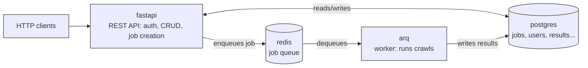

# OneCrawler Backend

[](https://www.python.org/)
[](https://fastapi.tiangolo.com/)
[](https://www.postgresql.org/)
[](https://redis.io/)
[](https://www.docker.com/)
[](https://playwright.dev/)
[](https://sayedshaun.github.io/onecrawler/)

FastAPI backend for **OneCrawler** — a web crawling and content-extraction platform. It exposes a REST API for auth, crawl jobs, settings, and extracted data, and drives the actual crawling/scraping work through an async job queue backed by [`onecrawler`](https://pypi.org/project/onecrawler/) (browser automation, link extraction, and content filters).

## Table of Contents

- [Architecture](#architecture)
- [Tech Stack](#tech-stack)
- [Project Structure](#project-structure)
- [Getting Started](#getting-started)
- [Configuration](#configuration)
- [Logging](#logging)
- [Database Migrations](#database-migrations)
- [Authentication](#authentication)
- [API Reference](#api-reference)
- [Crawl Modes, Strategies & Filters](#crawl-modes-strategies--filters)
- [Development](#development)
- [Testing](#testing)
- [Deployment Notes](#deployment-notes)
- [Troubleshooting](#troubleshooting)

## Architecture



The API and worker are split into separate containers built from the same [Dockerfile](Dockerfile) with different targets:

- **`api`** — only enqueues jobs onto Redis via [arq](https://arq-docs.helpmanual.io/); it never imports `onecrawler` or launches a browser, so its image stays small.
- **`worker`** — actually drives `onecrawler` + Playwright, so it installs the `onecrawler` package (GenAI extraction is a core dependency now, no extra needed) and Chromium.

A one-off **`migrate`** service runs `alembic upgrade head` before `fastapi`/`arq` start (see [docker-compose.yml](docker-compose.yml)).

## Tech Stack

| Concern | Choice |
| --- | --- |
| Web framework | [FastAPI](https://fastapi.tiangolo.com/) + Uvicorn |
| ORM / DB driver | SQLAlchemy 2.0 (async) + asyncpg |
| Database | PostgreSQL 16 |
| Job queue | [arq](https://arq-docs.helpmanual.io/) (Redis-backed) |
| Migrations | Alembic |
| Auth | JWT access + refresh tokens (PyJWT) + Argon2 password hashing |
| Validation / schemas | Pydantic v2 |
| Crawling engine | [`onecrawler`](https://pypi.org/project/onecrawler/) (Playwright-based) |
| Linting / formatting | ruff, ruff-format, docformatter (via pre-commit) |

Requires Python 3.12+.

## Project Structure

```
main.py                     FastAPI app entrypoint (lifespan, middleware, router mounts)
src/
  api/
    security/                JWT auth dependency (get_current_user) + /verify endpoint
    users/
      register/                create a user
      login/                    authenticate, issue access + refresh tokens
      logout/                   revoke the current access token and (optionally) a refresh session
      refresh/                  rotate a refresh token for a new access token
      account/                  get/rename/change email/change password + usage stats
      sessions/                 list/revoke active refresh-token sessions
    v1/
      crawler/                crawl job CRUD, retry, filters, settings schema
      dashboard/               aggregate stats for the UI
      data/                    extracted result items
      settings/                 crawl setting templates + provider API keys
  core/
    config.py                 pydantic-settings Settings (reads .env)
    security.py                JWT + password hashing
    sessions.py                 refresh-session bookkeeping (record/revoke/revoke-all)
    pool.py                     arq Redis connection pool
  db/
    models.py                   SQLAlchemy ORM models
    pg.py                        async engine/session
  worker/
    settings.py                  arq WorkerSettings
    settings_builder.py           maps a CrawlJob's JSON payload to onecrawler Settings/FilterChain
    tasks.py                      the actual crawl job (sitemap / link_extraction / crawler modes)
alembic/                        migrations
```

## Getting Started

### Prerequisites

- Docker + Docker Compose (recommended), **or** Python 3.12+, PostgreSQL 16, and Redis 7 if running natively.

### Quick start (Docker Compose)

```bash
cp .env.example .env
# edit .env — at minimum set a real JWT_SECRET_KEY before anything but local dev

docker compose up --build
```

This starts `postgres`, `redis`, runs migrations (`migrate`), then starts `fastapi` (http://localhost:8000) and the `arq` worker. A default admin user is seeded on first boot from `DEFAULT_ADMIN_*` in `.env`.

### Local development (live reload)

[`docker-compose.dev.yml`](docker-compose.dev.yml) bind-mounts the repo into the `fastapi`/`arq` containers and runs `uvicorn --reload`, so code edits apply without rebuilding:

```bash
docker compose -f docker-compose.yml -f docker-compose.dev.yml up
```

The `arq` worker doesn't hot-reload (job processes shouldn't restart mid-run) — restart it manually after worker-side changes:

```bash
docker compose restart arq
```

This dev overlay also starts an `ngrok` container that tunnels `fastapi` to a public URL — useful for testing webhooks or sharing a local build. Set `NGROK_AUTHTOKEN` in `.env` (get one from [dashboard.ngrok.com](https://dashboard.ngrok.com/get-started/your-authtoken)), then check the assigned URL at `http://localhost:4040`.

### Running without Docker

```bash
python -m venv .venv && source .venv/bin/activate   # or .venv\Scripts\activate on Windows
pip install -e .[worker]        # omit [worker] if you only need the API
playwright install chromium --with-deps   # only needed to actually run crawls

cp .env.example .env   # point POSTGRES_HOST / REDIS_URL at your local services
alembic upgrade head
uvicorn main:app --reload
# in another shell:
arq src.worker.settings.WorkerSettings
```

## Configuration

All configuration is via environment variables (`.env`, loaded by `src/core/config.py`). See [`.env.example`](.env.example) for the full annotated list; the essentials:

| Variable | Purpose | Default |
| --- | --- | --- |
| `POSTGRES_USER` / `POSTGRES_PASSWORD` / `POSTGRES_DB` | Postgres credentials | `onecrawler` |
| `POSTGRES_HOST` / `POSTGRES_PORT` | Postgres connection (compose service name in Docker) | `postgres` / `5432` |
| `REDIS_URL` | Redis connection for arq's job queue | `redis://redis:6379/0` |
| `JWT_SECRET_KEY` | Signing key for access & refresh tokens — **change this outside local dev** | `dev-secret-change-me` |
| `JWT_ALGORITHM` | JWT signing algorithm | `HS256` |
| `ACCESS_TOKEN_EXPIRE_MINUTES` | Access token lifetime | `60` |
| `REFRESH_TOKEN_EXPIRE_DAYS` | Refresh token lifetime | `30` |
| `DEFAULT_ADMIN_NAME` / `_EMAIL` / `_PASSWORD` | Seeded admin account (only created if no user with that email exists) | see `.env.example` |
| `CORS_ORIGINS` | JSON array of allowed origins | `["http://localhost:5173"]` |
| `LOG_LEVEL` | Root logging level (`DEBUG`/`INFO`/`WARNING`/`ERROR`) for the API and worker | `INFO` |
| `POSTGRES_HOST_PORT` / `REDIS_HOST_PORT` / `API_HOST_PORT` | Host-side port overrides for docker-compose | commented out |
| `NGROK_AUTHTOKEN` | Dev-only: public tunnel token for `docker-compose.dev.yml`'s `ngrok` service | unset |

Generate a real `JWT_SECRET_KEY` with:

```bash
python -c "import secrets; print(secrets.token_urlsafe(64))"
```

## Logging

`src/core/logger.py` configures the root logger (via `get_logger()`, called on startup by both `main.py` and `src/worker/settings.py`) with two handlers:

- A rotating file handler at `logs/app.log`, capped at 20MB with 3 backups.
- A console handler (visible via `docker compose logs`).

The level is controlled by `LOG_LEVEL`. Note `logs/` isn't a mounted volume, so file logs are lost if a container is recreated (not just restarted) — use `docker compose logs` for anything you need to survive that.

## Database Migrations

Standard Alembic workflow:

```bash
alembic upgrade head                 # apply all migrations
alembic revision -m "description"    # create a new empty migration
alembic downgrade -1                 # roll back one revision
```

Migrations live in [`alembic/versions/`](alembic/versions/) and run automatically via the `migrate` service in `docker-compose.yml` before the API/worker start.

## Authentication

Auth is JWT Bearer tokens (`Authorization: Bearer <token>`) with a short-lived **access token** plus a longer-lived **refresh token**, issued together by `POST /api/users/login`:

- **Access tokens** are validated by `HTTPBearer` (`src/api/security/dependencies.py`), expire after `ACCESS_TOKEN_EXPIRE_MINUTES`, and are individually revocable via a Redis blocklist keyed by the token's `jti` (used by logout).
- **Refresh tokens** exchange for a new access/refresh pair at `POST /api/users/refresh`. Each issued refresh token is tracked as a row in the `refresh_sessions` table (`src/core/sessions.py`), which is what makes per-session listing and revocation possible — `GET /api/users/me/sessions` lists active sessions, `DELETE /api/users/me/sessions/{id}` revokes one, and `POST /api/users/me/sessions/revoke-all` revokes all of them (also triggered automatically on password change).
- Refreshing **rotates** the token: the used refresh token is revoked and a new one issued, so a stolen refresh token stops working the next time the real owner refreshes.

**In Swagger (`/docs`):**
1. Call `POST /api/users/login` with your email/password (the seeded admin credentials are in `.env`).
2. Copy `accessToken` from the response.
3. Click **Authorize**, paste the raw token (no `Bearer ` prefix needed — Swagger adds it), and confirm.

## API Reference

Full interactive docs (with request/response schemas and a "Try it out" console) are served at `/docs` (Swagger UI) and `/redoc`; the raw OpenAPI spec is at `/openapi.json`.

<details>
<summary><strong>Misc</strong></summary>

| Method | Path | Description |
| --- | --- | --- |
| GET | `/` | Liveness message |
| GET | `/api/health` | Health check |
| GET | `/api/verify` | Verify a token / fetch the current user |

</details>

<details open>
<summary><strong>Users & Auth</strong> — <code>/api/users</code></summary>

| Method | Path | Description |
| --- | --- | --- |
| POST | `/api/users/register` | Create a user |
| POST | `/api/users/login` | Authenticate, get an access + refresh token |
| POST | `/api/users/logout` | Revoke the current access token (and refresh session, if provided) |
| POST | `/api/users/refresh` | Rotate a refresh token for a new access/refresh pair |
| GET | `/api/users/me` | Get the current user's profile |
| PATCH | `/api/users/me/name` | Rename the current user |
| PATCH | `/api/users/me/email` | Change email (requires current password) |
| PATCH | `/api/users/me/password` | Change password (requires current password; revokes all sessions) |
| GET | `/api/users/me/usage` | Crawl job / URL usage stats |
| GET | `/api/users/me/sessions` | List active refresh-token sessions |
| DELETE | `/api/users/me/sessions/{session_id}` | Revoke one session |
| POST | `/api/users/me/sessions/revoke-all` | Revoke all sessions ("log out everywhere") |

</details>

<details open>
<summary><strong>Crawls</strong> — <code>/api/v1/crawls</code></summary>

| Method | Path | Description |
| --- | --- | --- |
| POST | `/api/v1/crawls` | Create and enqueue a crawl job |
| GET | `/api/v1/crawls` | List crawl jobs (filter/paginate) |
| GET | `/api/v1/crawls/{job_id}` | Get a crawl job's detail + throughput history |
| GET | `/api/v1/crawls/{job_id}/download` | Download a job's results as JSON |
| GET | `/api/v1/crawls/{job_id}/logs` | Get a job's logs |
| GET | `/api/v1/crawls/{job_id}/discovered` | List URLs a job discovered |
| DELETE | `/api/v1/crawls/{job_id}/discovered/{discovered_id}` | Delete a discovered URL |
| POST | `/api/v1/crawls/{job_id}/scrape` | Scrape a job's discovered URLs as a new job |
| POST | `/api/v1/crawls/{job_id}/cancel` | Cancel a queued/running job |
| POST | `/api/v1/crawls/{job_id}/retry` | Re-run a failed job with the same settings |
| DELETE | `/api/v1/crawls/{job_id}` | Delete a crawl job (must not be active) |

</details>

<details>
<summary><strong>Dashboard & Data</strong> — <code>/api/v1/dashboard</code>, <code>/api/v1/data</code></summary>

| Method | Path | Description |
| --- | --- | --- |
| GET | `/api/v1/dashboard/overview` | Aggregate stats for the dashboard |
| GET | `/api/v1/data` | List/search extracted result items |
| GET | `/api/v1/data/{result_id}` | Get one extracted result item |
| GET | `/api/v1/data/{result_id}/download` | Download a result item's content as JSON |

</details>

<details>
<summary><strong>Settings</strong> — <code>/api/v1/settings</code></summary>

| Method | Path | Description |
| --- | --- | --- |
| GET/POST/PUT/DELETE | `/api/v1/settings/templates[/{id}]` | Crawl setting templates |
| GET/PUT/DELETE | `/api/v1/settings/api-keys[/{provider}]` | Stored GenAI provider API keys |

</details>

## Crawl Modes, Strategies & Filters

A crawl job (`POST /api/v1/crawls`) picks one **mode**:

- `sitemap` — discovers URLs from a site's sitemap.
- `link_extraction` — follows links (`shallow` or `deep`) from the target URL.
- `crawler` — full crawl + content extraction, streaming results as `CrawlResultItem` rows.

For `crawler` mode, `scraping_strategy` controls how page content is turned into structured data:

- `heuristic` — fixed extraction fields (title, text, metadata) via `onecrawler`'s built-in parser. Article/news-biased; can return little or nothing on non-article pages.
- `genai` — an LLM extracts fields matching a caller-defined `output_schema` (arbitrary field names/types).
- `markdownify` — faithful whole-page HTML-to-Markdown conversion; no content extraction or metadata, but never returns empty for a rendered page. Useful for non-article pages (e-commerce, dashboards, docs) where `heuristic` falls short.

Because these strategies produce differently-shaped output, `CrawlResultItem.content` is stored as `JSONB` rather than a fixed set of columns.

Optional `filters` (AND/OR trees of `FilterNodeIn` nodes) narrow which discovered pages get scraped: `by_date` (validated as `YYYY-MM-DD`), `by_keywords`, `by_files`, `by_extension`, `by_cosine_similarity`.

## Development

Pre-commit runs ruff (lint + import sorting + `X | None` typing), ruff-format, and docformatter (docstring wrapping):

```bash
pip install pre-commit
pre-commit install
pre-commit run --all-files
```

Follow [AGENTS.md](AGENTS.md) / [CLAUDE.md](CLAUDE.md) for code style conventions used throughout this repo.

## Testing

There is no automated test suite yet. Verify changes by exercising the running API — via Swagger (`/docs`), `curl`, or by tailing the worker's logs (`docker compose logs -f arq`) while a crawl job runs. When adding tests, prefer `pytest` + `httpx.AsyncClient` against the FastAPI app, and a real (containerized) Postgres/Redis over mocks.

## Deployment Notes

- The `api` and `worker` images are independent (see [Dockerfile](Dockerfile) targets) — deploy/scale them separately; only `worker` needs Playwright/Chromium.
- Run `alembic upgrade head` before starting new API/worker versions (the `migrate` service in `docker-compose.yml` models this as a one-off job that `fastapi`/`arq` wait on via `service_completed_successfully`).
- Set a real `JWT_SECRET_KEY` and rotate the seeded default admin password before exposing this beyond local dev.
- `CORS_ORIGINS` must list your actual frontend origin(s) in production.
- `refresh_sessions` rows are never deleted, only marked `revoked_at` — there's no cleanup job yet, so the table grows unbounded with login volume. Fine at small scale; add a periodic prune of expired/revoked rows before this matters.

## Troubleshooting

- **`alembic upgrade head` fails on a running container**: if you're iterating on a migration, copy the updated file into the container (`docker cp`) or rebuild the image — code isn't hot-reloaded unless you're using `docker-compose.dev.yml`'s bind mount.
- **Windows line endings**: the repo is LF-based; Git will warn about CRLF conversion on Windows checkouts — this is expected and harmless.
- **A crawl job fails immediately with a date-parsing error**: `filters` nodes of kind `by_date` require `start`/`end` in `YYYY-MM-DD` format; anything else is rejected at request time with a `422`.
- **`401 Invalid or expired refresh token` right after a password change**: expected — changing your password revokes every refresh session, including the one the client is holding. Log in again.
